# VaultBox

<p align="left">
  
</p>

**Hard asset inventory** for bullion, crypto, and other vaulted goods. Local-first: you run it on your machine. It is not a public internet service.

[](LICENSE)
[](README.md)

Passkeys (WebAuthn) are the sign-in method. Use **http://localhost:5173** in development, or the container App URL — `127.0.0.1` will fail passkey registration.

Project site (static): [site/index.html](site/index.html). After GitHub Pages is on: https://ty-haller.github.io/VaultBox/

## Requirements

- **Docker Engine** or **Podman**, or Python 3.11+ and Node.js 20+
- A browser that supports passkeys

## Docker vs Podman

Either engine can build and run the image. `scripts/bootstrap.sh` uses `docker` if `docker info` works, otherwise **Podman**.

| | Docker Engine | Podman (Fedora/RHEL default) |
|---|---|---|
| Install | [docs.docker.com/engine/install](https://docs.docker.com/engine/install/) | `sudo dnf install -y podman podman-compose` |
| Daemon | `sudo systemctl enable --now docker`; user in `docker` group | Rootless; no daemon |
| CLI | `docker` / `docker compose` | `podman` / `podman compose` (or `DOCKER=podman ./scripts/bootstrap.sh`) |
| HTTP bind | Script publishes **127.0.0.1:8000** (avoids IPv6 `localhost` resets on rootless stacks) | Same |
| Ports 80/443 | Fine as root/docker group | Rootless cannot bind 80/443 unless you lower `net.ipv4.ip_unprivileged_port_start`; use 8080/8443 instead |

Optional shim if you want the `docker` command on a Podman host:

```bash
mkdir -p ~/.local/bin
printf '%s\n' '#!/bin/sh' 'exec podman "$@"' > ~/.local/bin/docker
chmod +x ~/.local/bin/docker
```

## Install (HTTP)

From a clone:

```bash
git clone https://github.com/Ty-Haller/VaultBox.git
cd VaultBox
chmod +x scripts/bootstrap.sh
./scripts/bootstrap.sh
```

The script builds the image, writes `.env` if missing, and publishes **http://localhost:8000**. Open that URL (not `127.0.0.1`) and **Register Admin Passkey**. Data lives in the volume `vaultbox-data`.

```bash
docker logs -f vaultbox    # or: podman logs -f vaultbox
docker stop vaultbox
```

Compose (same HTTP setup), after copying [`.env.example`](.env.example) to `.env`:

```bash
docker compose up --build -d
# or: podman compose up --build -d
```

## HTTPS (Caddy)

Caddy sits in front of VaultBox, terminates TLS, and forwards to the app. Set `VAULTBOX_HOSTNAME` to the name in the browser (that is also the WebAuthn RP ID). After a hostname change, register a new admin passkey at the new App URL.

Stop the HTTP container first if it is already running (`docker stop vaultbox` or `docker compose down`).

**LAN / localhost** (Caddy local CA, no public DNS):

```bash
# .env should include VAULTBOX_HOSTNAME=localhost (or vault.home.arpa)
docker compose -f docker-compose.https.yml up --build -d
# Copy Caddy's local CA onto the host and trust it in the OS/browser (once):
docker compose -f docker-compose.https.yml cp \
  caddy:/data/caddy/pki/authorities/local/root.crt ./caddy-local-root.crt
```

Import `caddy-local-root.crt` (Firefox/Chrome certificate settings, or `sudo trust anchor ./caddy-local-root.crt` on Fedora). Open **https://localhost/login** (or `https://$VAULTBOX_HOSTNAME/login`). Keep `tls internal` in `deploy/Caddyfile.internal`.

**Public hostname** (Let’s Encrypt): DNS for `VAULTBOX_HOSTNAME` must point here, and ports 80 + 443 must be reachable.

```bash
export VAULTBOX_HOSTNAME=vault.example.com
export CADDY_EMAIL=you@example.com
export CADDYFILE=./deploy/Caddyfile
docker compose -f docker-compose.https.yml up --build -d
```

**Rootless Podman** (cannot bind 80/443):

```bash
export CADDY_HTTP_PORT=8080
export CADDY_HTTPS_PORT=8443
export VAULTBOX_HTTP_PORT=8443
export VAULTBOX_HOSTNAME=localhost
docker compose -f docker-compose.https.yml up --build -d
```

Then use **https://localhost:8443/login**.

Caddy files: [`deploy/Caddyfile.internal`](deploy/Caddyfile.internal) (LAN) and [`deploy/Caddyfile`](deploy/Caddyfile) (Let’s Encrypt). Traefik or nginx would work the same way: TLS in front, proxy to `vaultbox:8000`, send `Host` and `X-Forwarded-Proto`.

## Quick start (development)

```bash
git clone https://github.com/Ty-Haller/VaultBox.git
cd VaultBox

python3 -m pip install --user -r backend/requirements.txt
cd backend
python3 manage.py migrate
python3 manage.py seed_roles
python3 manage.py seed_admin
python3 manage.py seed_notifications
python3 manage.py seed_data          # optional demo holdings
python3 manage.py runserver          # http://127.0.0.1:8000
```

```bash
npm install
npm run dev                          # http://localhost:5173
```

First visit [http://localhost:5173/login](http://localhost:5173/login) and **Register Admin Passkey** for user `admin`. There is no password login.

On first backend start Django writes a repo-root `.env` (`SECRET_KEY`, `VAULTBOX_ENCRYPTION_KEY`, mode `0600`). Do not commit `.env`. See [`.env.example`](.env.example) and [SECURITY.md](SECURITY.md).

Reset demo inventory later from **Admin → Danger zone** (type `RESET`), or `python3 manage.py seed_data --flush`.

## Features

- **Inventory** — Site → Vault → Holding, including bullion, crypto, gems, watches
- **Passkeys** — WebAuthn; optional OIDC SSO
- **Audits** — Standard and advanced vault counts; cancelable sessions
- **Reports** — Portfolio, inventory, QR labels, purchase/sale, P/L (PDF + CSV)
- **Live prices** — Metals (and ticker crypto/stocks) with fallback warnings
- **Notifications** — Event engine with in-app, email (SMTP), and [Apprise](https://github.com/caronc/apprise) (Discord, Slack, Telegram, and other URL targets)
- **Alerts** — Spot/market % change and price above/below; vault audit due/overdue and capacity; holding gain/loss; insurance expiry; plus audit, admin, and inventory events
- **QR labels** — Per holding; lookup at `/lookup/:code`
- **Backups** — On-demand and scheduled SQLite + media archives (optional encryption + rclone)
- **Secrets** — Encrypted seed phrases and recovery data
- **Admin** — NetBox-style taxonomy, users, roles

## Screenshots

Captured from the local demo at [http://localhost:5173](http://localhost:5173). Passkeys fail on `127.0.0.1`.

**Login** — VaultBox, Hard Asset Inventory, passkey sign-in.

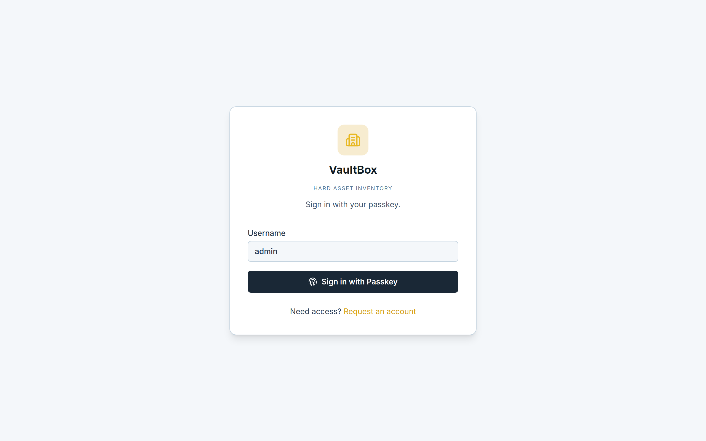

**Dashboard** — portfolio totals, charts, and the live price ticker.

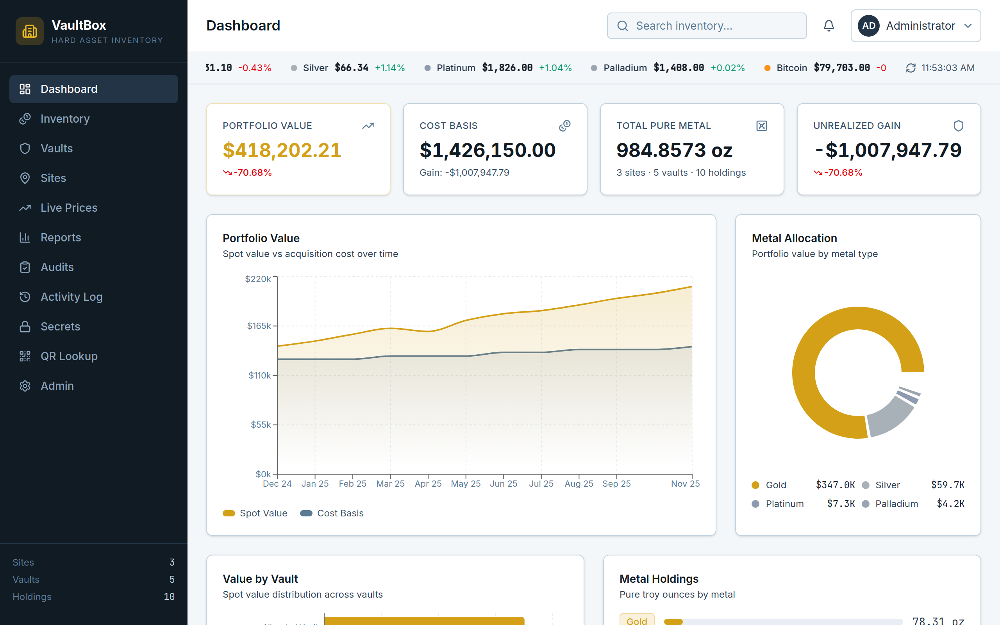

**Inventory** — holdings table with filters and CSV export.

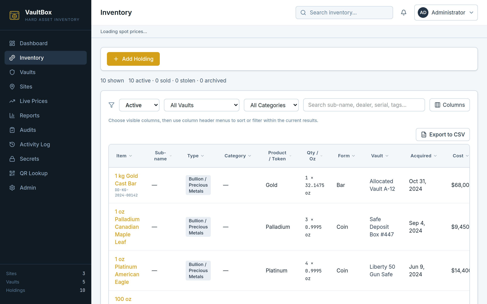

**Vault** — one vault: audit status, utilization, holdings.

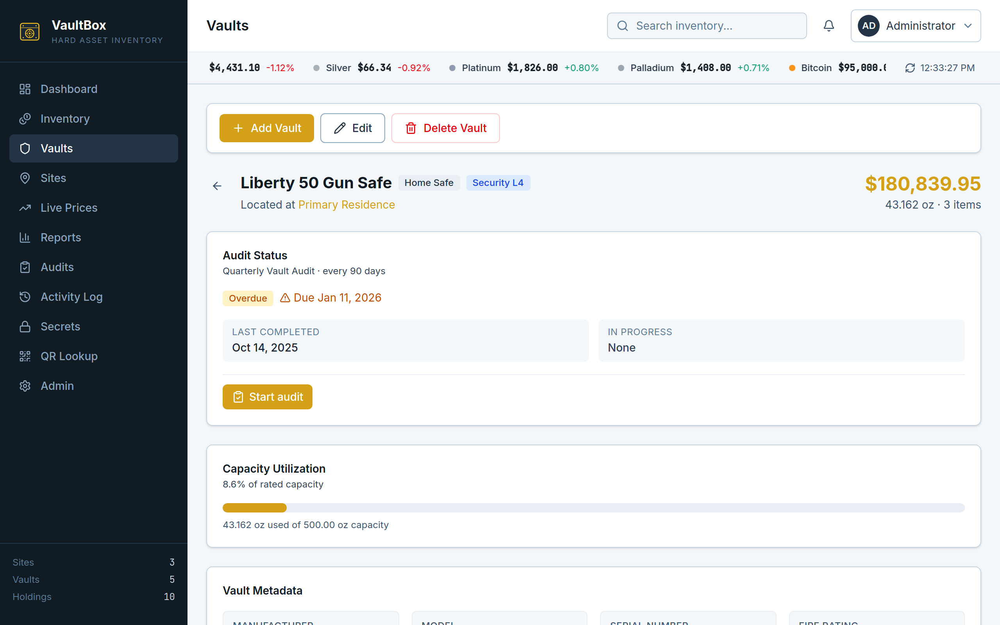

**Reports** — PDFs plus purchases & sales (all-time).

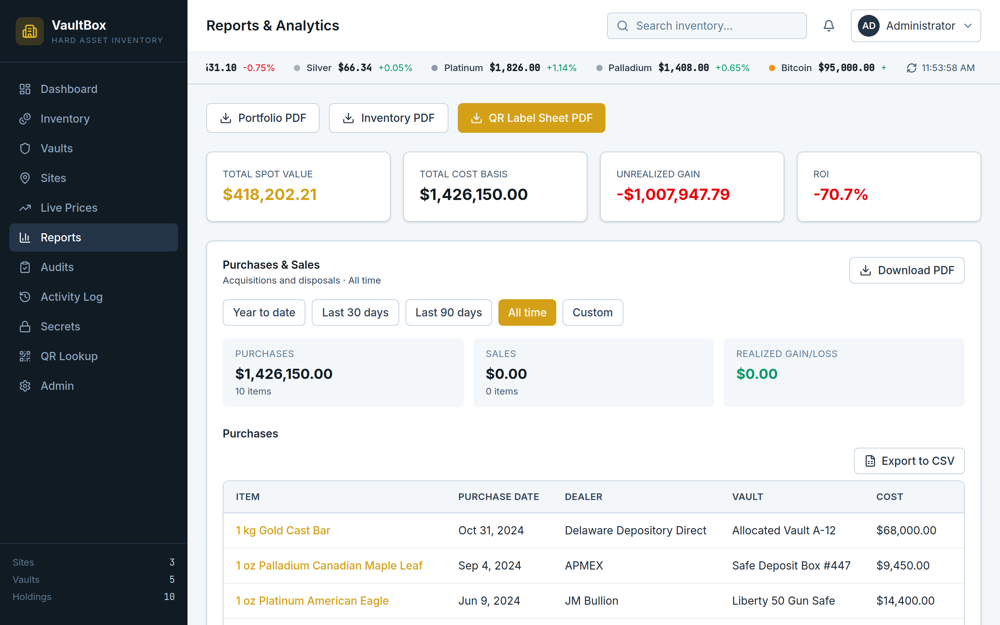

**Admin** — taxonomy, users, backups, SSO.

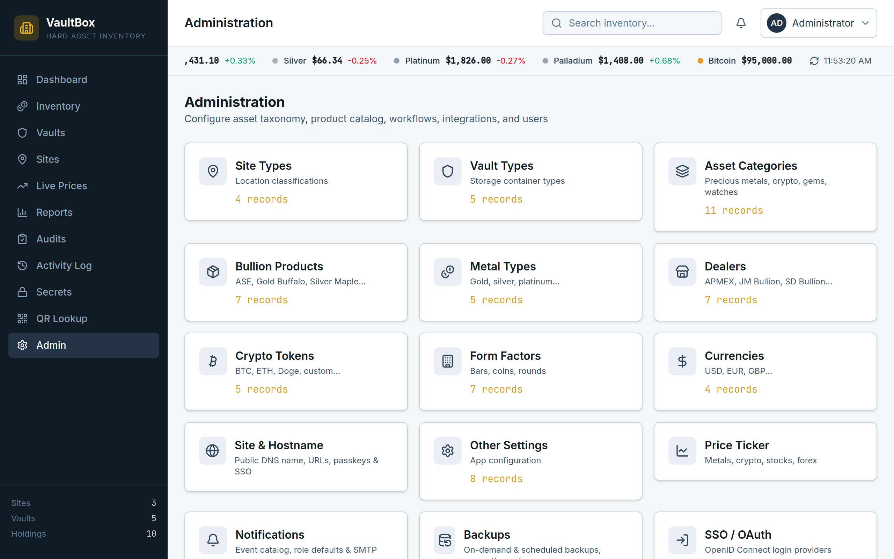

**Notification defaults** — system event catalog and default channels (in-app, email, Apprise).

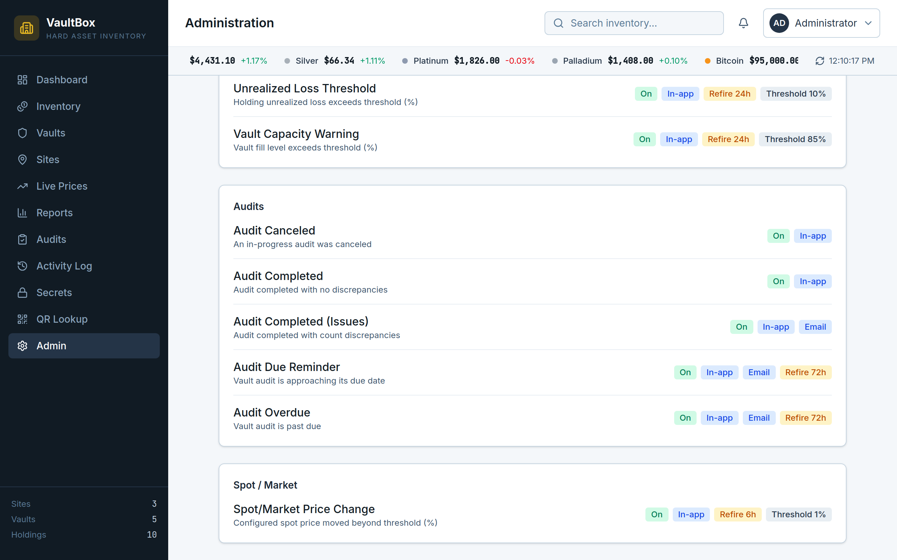

**Role defaults** — per-role subscriptions for the notification engine.

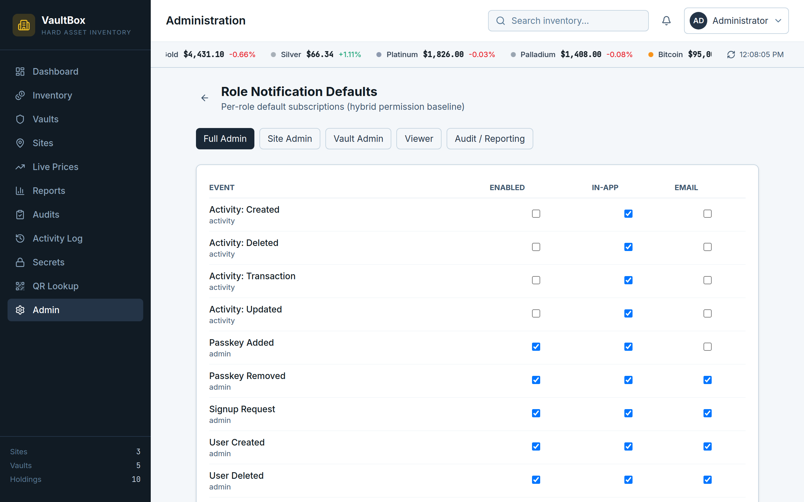

**Notification preferences** — which alerts you get and how they are delivered.

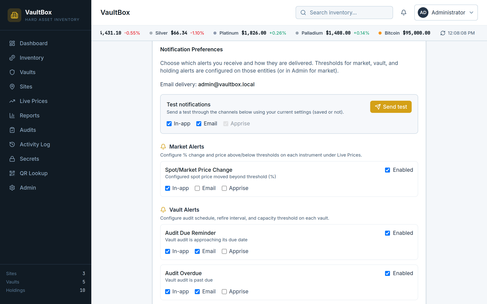

**Apprise** — pick Discord, Slack, Telegram, and other URL targets (no secrets in this shot).

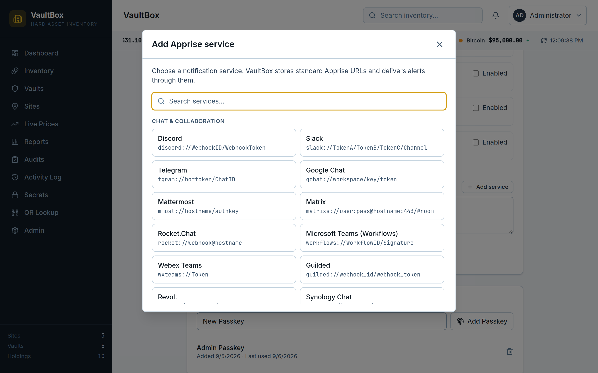

**Market alerts** — % change and price above/below on an instrument; delivery is in user preferences.

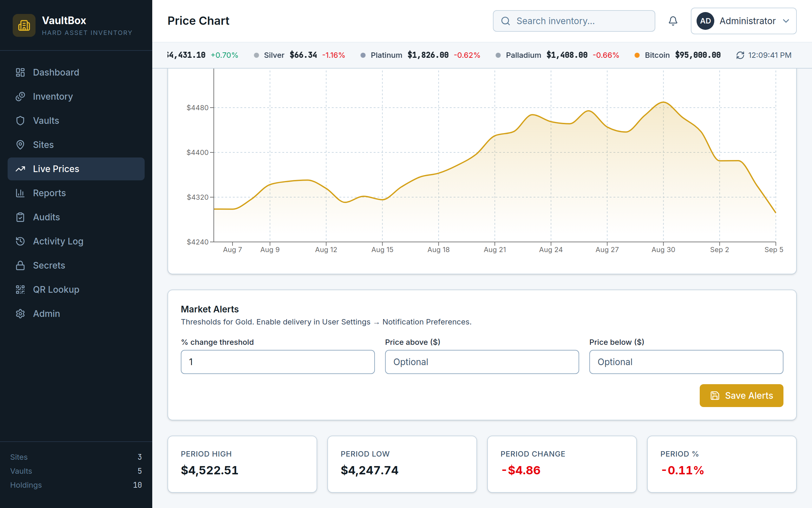

**SMTP delivery** — admin relay for email notifications.

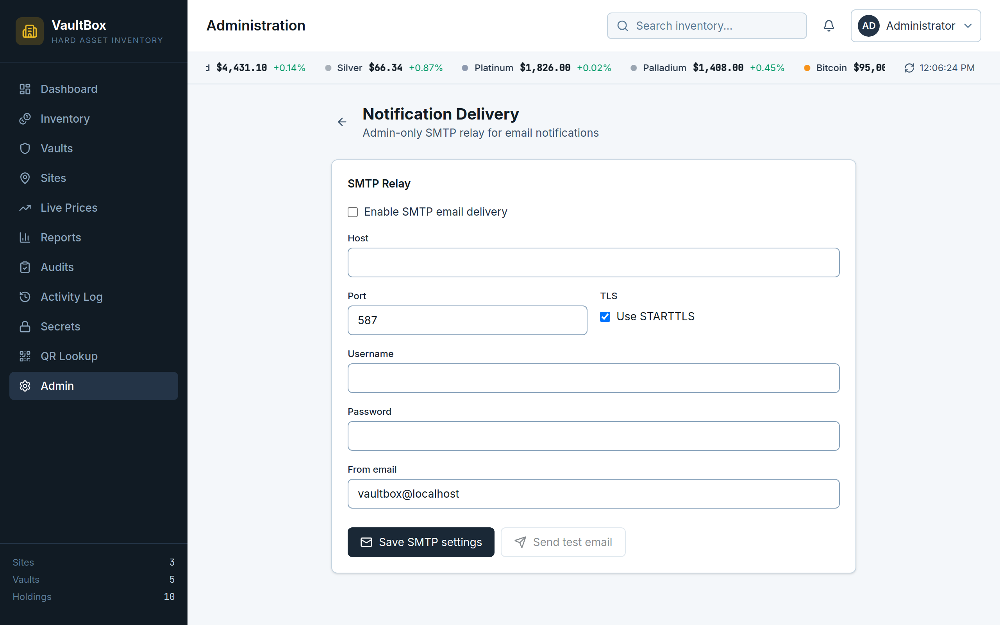

## Authentication

Passkey login is always on. SSO is optional under **Admin → SSO / OAuth**. Callback URL:

`{backend-base}/api/auth/oauth/{provider-id}/callback/`

Set the public hostname in `.env` (`VAULTBOX_HOSTNAME`, optional `VAULTBOX_USE_HTTPS=true`) or under **Admin → Site & Hostname**. Open the **App URL** shown on that page — passkeys fail if the browser host does not match the RP ID. Dev `localhost` uses ports 5173 / 8000; Docker HTTP uses **http://localhost:8000**; Docker+Caddy uses **https://** plus that hostname. `127.0.0.1` is not valid for passkeys. After a hostname/RP ID change, open the new App URL and **register a new admin passkey** (login offers bootstrap because that host has no keys yet). Keep the old session open until that succeeds if you may need to revert. When the new host has a key, Full Admin can remove leftover old-host passkeys from **Admin → Danger zone**.

## Backups

**Admin → Backups**

- Plain `.tar.gz` or encrypted `.vaultbox` (AES-256-GCM). The archive password is not stored — lose it and the backup cannot be restored.
- Scheduled retention (keep N) via `python3 manage.py run_scheduled_backups`.
- Optional rclone off-site copy (`rclone` must be on `PATH`).

Keep `.env` with the database. Changing `VAULTBOX_ENCRYPTION_KEY` makes existing Fernet ciphertext (holding secrets, wrapped schedule passwords) undecryptable.

Restart the app after a restore so Django reloads SQLite.

## API (abridged)

Authenticated JSON at `/api/`. UUID primary keys.

| Resource | Path |
|----------|------|
| Sites / vaults / holdings | `/api/sites/`, `/api/vaults/`, `/api/holdings/` |
| QR lookup | `/api/lookup/{code}/` |
| PDFs | `/api/reports/{portfolio\|inventory\|labels\|purchase-sale\|profit-loss}.pdf` |
| Auth | `/api/auth/` (passkeys, CSRF, SSO) |
| Admin | `/api/admin/…` |
| Demo seed (Full Admin) | `POST /api/seed/` |

## Tech stack

<p>
  <a href="https://react.dev"></a>
  &nbsp;
  <a href="https://www.typescriptlang.org"></a>
  &nbsp;
  <a href="https://vite.dev"></a>
  &nbsp;
  <a href="https://tailwindcss.com"></a>
  &nbsp;
  <a href="https://www.djangoproject.com"></a>
  &nbsp;
  <a href="https://www.sqlite.org"></a>
  &nbsp;
  <a href="https://www.docker.com"></a>
</p>

React 19 · TypeScript · Vite · Tailwind CSS v4 · Django 6 · SQLite · Docker (or Podman)

Also: Django REST Framework, Recharts, React Router, Pillow, ReportLab, qrcode, webauthn, cryptography, Apprise.

## Support

VaultBox is free, local-first software. If it is useful, you can fund development:

- [GitHub Sponsors](https://github.com/sponsors/Ty-Haller)
- [Buy Me a Coffee](https://www.buymeacoffee.com/tyhaller)
- [PayPal.Me](https://paypal.me/hallerty)

News and chat: [X / @hallert](https://x.com/hallert)

## License

[Apache License 2.0](LICENSE). See [NOTICE](NOTICE). Contributions are under the same license ([CONTRIBUTING.md](CONTRIBUTING.md)).

## Security

See [SECURITY.md](SECURITY.md). This tree is meant to stay on localhost or a private network — not on the public internet.
